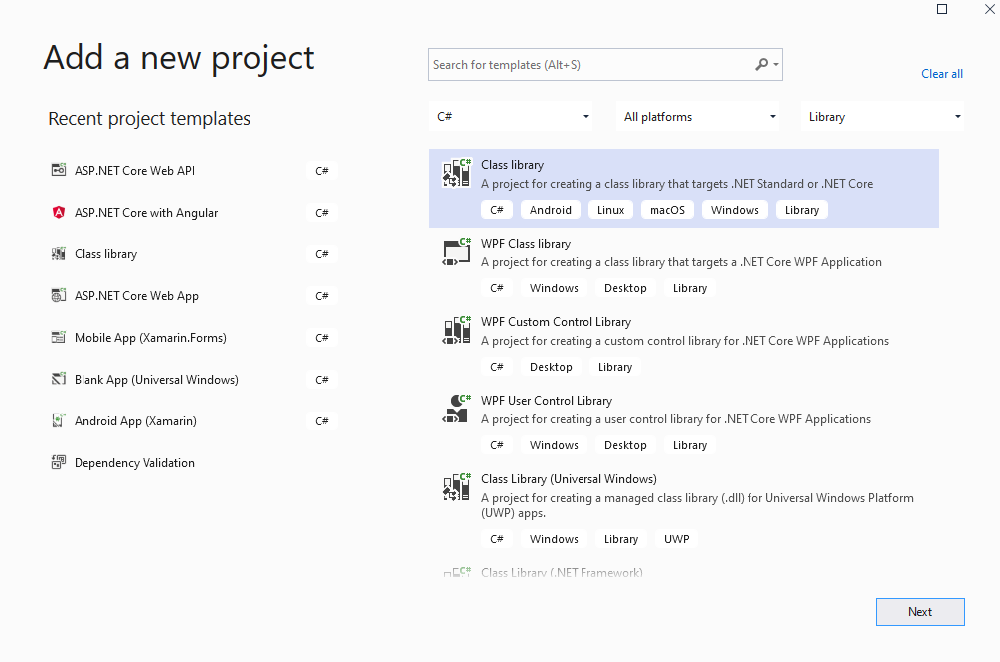
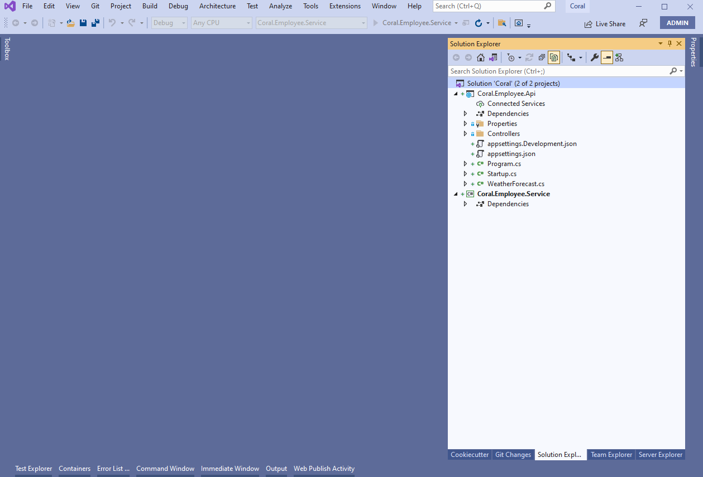

# Developing Microservices using .Net 5 #

## Introduction ##

 

This article is the second part of series covering planning, solutioning, designing, developing, deploying and protecting Microservices deployed to Azure Kubernetes Services -

 

- [Planning and  Solutioning Microservices using Domain Driven Design](https://github.com/AmanpreetSingh-GitHub/Planning-and-Solutioning-Microservices-using-Domain-Driven-Design)
- Developing Microservices using .Net 5
- [Deploying-Microservices to Azure Kubernetes Services](https://github.com/AmanpreetSingh-GitHub/Deploying-Microservices-to-Azure-Kubernetes-Services)
- [Inter Microservices communication using Azure Service Bus](https://github.com/AmanpreetSingh-GitHub/Inter-Microservices-communication-using-Azure-Service-Bus)
- [Using Redis cache to increase performance during inter Microservices communicaiton](https://github.com/AmanpreetSingh-GitHub/Using-Redis-cache-to-increase-performance-during-inter-Microservices-communicaiton)
- [Protecting Microservices inside Azure Kubernetes Services using Azure API Management](https://github.com/AmanpreetSingh-GitHub/Protecting-Microservices-inside-Azure-Kubernetes-Services-using-Azure-API-Management)
- [Authenticate Microservices inside Azure Kubernetes Services using Azure Active Directory](https://github.com/AmanpreetSingh-GitHub/Authenticate-Microservices-inside-Azure-Kubernetes-Services-using-Azure-Active-Directory)

 

This article covers following things –

- Developing Microservices in .Net 5.0 following Mediator and Command Query Responsibility Segregation Pattern and using Generic Repository and Unit of Work. Below are the layers of the n-layered architecture -
  - Api layer
    - ASP.NET Core Web API project targetting .NET 5.0 framework
    - Clients will call Api Layer methods to fetch data. Api Layer in turn calls Service Layer for processing
    - Implements disconnected architecture
  - Service layer
    - .NET 5.0 Class Library project
    - It holds orchestration and business logic
    - Service layer calls Broker layer that implements Mediator and CQRS to fetch data from Persistance layer  
  - Broker layer
    - .NET 5.0 Class Library project
    - Broker layer implements Mediator and CQRS to fetch data from Persistance layer for CRUD operations
  - Domain layer
    - .NET 5.0 Class Library project
    - Service layer returns data in Domain objects to the Api layer
  - Persistence layer
    - .NET 5.0 Class Library project
    - It holds Entity Framework Core Context and Entities
    - It also holds code for CRUD operations using Generic Repository and Unit-of-Work patterns
- Development environment setup
- Creating Azure SQL Database
- Using Entity Framework Core for data access
- Using Generic Repository and Unit-of-Work patterns
- Using Mediator and Command Query Responsibility Segregation patterns

 

## Environment Setup ##

- We are using Microsoft Visual Studio Enterprise 2019 with Version 16.10.2

    

 

## Basic Solution and Project creation ##

 

- Create a blank solution (Coral) to contain all the projects

    
    

 

- Add a new ASP.Net Core Web API project (Coral.Employee.Api) targetting .NET 5.0 framework

    
    
    
    

 

- Add a Class Library project (Coral.Employee.Service) targetting .NET 5.0 framework

    
    
    
    

 

- Add a Class Library project (Coral.Employee.Domain) targetting .NET 5.0 framework

    
    
    
    

 

- Add a Class Library project (Coral.Employee.Persistance) targetting .NET 5.0 framework

    
    
    
    

 

- Add a Class Library project (Coral.Employee.Broker) targetting .NET 5.0 framework

    
    
    

 

- Build the solution

 

## Adding Project References ##

 

- Add Coral.Employee.Service reference in Coral.Employee.Api project

    

 

- Add Coral.Employee.Persistance and Coral.Employee.Domain reference in Coral.Employee.Broker project

    

 

- Add Coral.Employee.Broker, Coral.Employee.Persistance and Coral.Employee.Domain reference in Coral.Employee.Service project

    

 

- Build the solution

    

 

## Restructure the projects for better management ##

 

- Add Employee folder and move Coral.Employee.Api, Coral.Employee.Service, Coral.Employee.Broker, Coral.Employee.Persistance and Coral.Employee.Domain projects inside Employee folder

    

 

## Add Domain object ##

 

- Add EmployeeCompositeInfo to Coral.Employee.Domain project that is used to return data to the clients by Api layer

	>		using System;
	>		
	>		namespace Coral.Employee.Domain
	>		{
	>		    public class EmployeeCompositeInfo
	>		    {
	>		        public string EmployeeId { get; set; }
	>		        public string EmployeeNumber { get; set; }
	>		        public string FirstName { get; set; }
	>		        public string MiddleName { get; set; }
	>		        public string LastName { get; set; }
	>		        public string Gender { get; set; }
	>		        public DateTime DateOfBirth { get; set; }
	>		        public string ContactNumber { get; set; }
	>		        public string OfficeEmail { get; set; }
	>		        public string Address { get; set; }
	>		        public string FatherName { get; set; }
	>		        public string SpouseName { get; set; }
	>		        public int StatusId { get; set; }
	>		        public string StatusName { get; set; }
	>		        public int MaritalStatusId { get; set; }
	>		        public bool IsDeleted { get; set; }
	>		        public string CreatedBy { get; set; }
	>		        public DateTime CreatedDate { get; set; }
	>		        public string UpdatedBy { get; set; }
	>		        public DateTime UpdatedDate { get; set; }
	>		    }
	>		}
	>		

 

## Add project for cross-cutting concerns ##

 

- Add another folder Infrastructure in the solution

- Add a Class Library project (Coral.Infrastructure.CrossCutting) targetting .NET 5.0 framework inside Infrastructure folder. This project will hold data and logic that is used across projects

    
    
    

 

- Add Coral.Infrastructure.CrossCutting reference also in Coral.Employee.Service project

    

 

- Add Coral.Infrastructure.CrossCutting reference also in Coral.Employee.Broker project

    

 

## Setup Azure SQL Database ##

 

- Create new resource group (coral) in Azure

    

 

- Create a new Aure SQL Database Server (coraldbserver) to hold Azure SQL Database

    
    
    

 

- Create a new Azure SQL Database (Employee)

    
    

 

- Create EmployeeBasicInfo table in the database using SQL Server Management Studio and add some data to the table

- Below is the Create table script

    >     CREATE TABLE [dbo].[EmployeeBasicInfo](
    >      [EmployeeId] [varchar](36) NOT NULL,
    >      [EmployeeNumber] [varchar](8) NOT NULL,
    >      [FirstName] [varchar](100) NOT NULL,
    >      [MiddleName] [varchar](100) NULL,
    >      [LastName] [varchar](100) NOT NULL,
    >      [Gender] [char](1) NOT NULL,
    >      [DateOfBirth] [date] NOT NULL,
    >      [ContactNumber] [varchar](10) NOT NULL,
    >      [OfficeEmail] [varchar](200) NOT NULL,
    >      [Address] [varchar](500) NOT NULL,
    >      [FatherName] [varchar](200) NOT NULL,
    >      [SpouseName] [varchar](200) NULL,
    >      [StatusId] [int] NOT NULL,
    >      [MaritalStatusId] [int] NOT NULL,
    >      [CreatedBy] [varchar](200) NOT NULL,
    >      [CreatedDate] [datetime] NOT NULL,
    >      [UpdatedBy] [varchar](200) NULL,
    >      [UpdatedDate] [datetime] NOT NULL,
    >      [IsDeleted] [bit] NULL,
    >     CONSTRAINT [PK_EmployeeBasicInfo] PRIMARY KEY CLUSTERED 
    >     (
    >      [EmployeeId] ASC
    >     )WITH (STATISTICS_NORECOMPUTE = OFF, IGNORE_DUP_KEY = OFF) ON [PRIMARY]
    >     ) ON [PRIMARY]

 

- Below is the Insert script

    >     USE [Employee]
    >     GO
    >
    >     INSERT INTO [dbo].[EmployeeBasicInfo]
    >      ([EmployeeId], [EmployeeNumber], [FirstName], [MiddleName], [LastName], [Gender], [DateOfBirth], [ContactNumber], [OfficeEmail], [Address], [FatherName], [SpouseName], [StatusId], [MaritalStatusId], [CreatedBy], [CreatedDate], [UpdatedBy], [UpdatedDate], [IsDeleted])
    >     VALUES
    >      ('0088ED21-F2F3-41E3-8D19-24960AE17A14', 'ABC12345', 'Tom', NULL, 'Cat', 'M', '1981-04-18', '9876543210', 'tom.cat@microsoft.com', 'Tom Land', 'Tom Cat Senior', NULL, 1, 1, 'Admin', GETDATE(), 'Admin', GETDATE(), '0');
    >
    >     INSERT INTO [dbo].[EmployeeBasicInfo]
    >      ([EmployeeId], [EmployeeNumber], [FirstName], [MiddleName], [LastName], [Gender], [DateOfBirth], [ContactNumber], [OfficeEmail], [Address], [FatherName], [SpouseName], [StatusId], [MaritalStatusId], [CreatedBy], [CreatedDate], [UpdatedBy], [UpdatedDate], [IsDeleted])
    >     VALUES
    >      ('0128849d-13cb-4abb-b500-9e779b7384bf', 'DEF12345', 'Jerry', NULL, 'Mouse', 'M', '1991-05-15', '0123456789', 'jerry.mouse@microsoft.com', 'Jerry Land', 'Jerry Mouse Senior', NULL, 1, 1, 'Admin', GETDATE(), 'Admin', GETDATE(), '0')
    >
    >     GO

 

## Generate EF Core Models and Context by reverse engineering Employee database using Entity Framework Core Power Tools ##

 

- Use EF Core Power Tools in Coral.Employee.Persistance project

    

 

- Connect to Azure SQL Employee Database

    
    

 

- Select EmployeeBasicInfo table
    

 

- Setup parameters

    

 

- Build the solution

    

 

## Add Unit of Work, Generic Repository and EmployeBasicInfo Repository ##

 

- To the Coral.Employee.Persistance add two folder
    - Interfaces
    - Repositories

- Add IUnitOfWork and IGenericRepository interfaces

    >		using Coral.Employee.Persistance.Context;
	>		
	>		namespace Coral.Employee.Persistance.Interfaces
	>		{
	>		    public interface IUnitOfWork
	>		    {
	>		        EmployeeDBContext DbContext { get; }
	>		
	>		        int Save();
	>		    }
	>		}

	>		using System;
	>		using System.Collections.Generic;
	>		using System.Linq.Expressions;
	>		using System.Threading.Tasks;
	>		
	>		namespace Coral.Employee.Persistance.Interfaces
	>		{
	>		    public interface IGenericRepository<T> where T : class
	>		    {
	>		        Task<T> GetItem(Expression<Func<T, bool>> filter);
	>		        Task<T> GetItemWithChildren(Expression<Func<T, bool>> filter, params Expression<Func<T, object>>[] children);
	>		        Task<List<T>> GetAll();
	>		        Task<List<T>> GetAllPaged(int pageNo, int recordsPerPage);
	>		        Task<List<T>> GetList(Expression<Func<T, bool>> filter);
	>		        Task<List<T>> GetListWithChildren(Expression<Func<T, bool>> filter, params Expression<Func<T, object>>[] children);
	>		        void Add(T entity);
	>		    }
	>		}

 

- Add UnitOfWork (implementing IUnitOfWork) and GenericRepository (implementing IGenericRepository)

	>		using Coral.Employee.Persistance.Context;
	>		using Coral.Employee.Persistance.Interfaces;
	>		
	>		namespace Coral.Employee.Persistance.Repositories
	>		{
	>		    public class UnitOfWork : IUnitOfWork
	>		    {
	>		        private EmployeeDBContext _dbContext;
	>		
	>		        public EmployeeDBContext DbContext => _dbContext;
	>		        
	>		        public UnitOfWork(EmployeeDBContext dbContext) => _dbContext = dbContext;
	>		
	>		        public int Save()
	>		        {
	>		            return _dbContext.SaveChanges();
	>		        }
	>		    }
	>		}

	>		using System;
	>		using System.Linq.Expressions;
	>		using System.Collections.Generic;
	>		using System.Linq;
	>		using System.Threading.Tasks;
	>		using Microsoft.EntityFrameworkCore;
	>		using Coral.Employee.Persistance.Interfaces;
	>		using Coral.Employee.Persistance.Context;
	>		
	>		namespace Coral.Employee.Persistance.Repositories
	>		{
	>		    public class GenericRepository<T> : IGenericRepository<T> where T : class
	>		    {
	>		        protected EmployeeDBContext _context;
	>		
	>		        public GenericRepository(IUnitOfWork unitOfWork) => _context = unitOfWork.DbContext;
	>		
	>		        public async Task<List<T>> GetAll()
	>		        {
	>		            IQueryable<T> query = _context.Set<T>();
	>		            return await query.ToListAsync<T>();
	>		        }
	>		
	>		        public async Task<List<T>> GetAllPaged(int pageNo, int recordsPerPage)
	>		        {
	>		            IQueryable<T> query = _context.Set<T>().Skip((pageNo - 1) * recordsPerPage).Take(recordsPerPage);
	>		            return await query.ToListAsync<T>();
	>		        }
	>		
	>		        public async Task<T> GetItem(Expression<Func<T, bool>> filter)
	>		        {
	>		            IQueryable<T> query = _context.Set<T>();
	>		            if (filter != null)
	>		            {
	>		                query = query.Where(filter);
	>		            }
	>		            return await query.FirstOrDefaultAsync();
	>		        }
	>		
	>		        public async Task<T> GetItemWithChildren(Expression<Func<T, bool>> filter, params Expression<Func<T, object>>[] children)
	>		        {
	>		            IQueryable<T> query = _context.Set<T>();
	>		            if (children.Length > 0)
	>		            {
	>		                query = children.Aggregate(query, (current, include) => current.Include(include));
	>		            }
	>		            if (filter != null)
	>		            {
	>		                query = query.Where(filter);
	>		            }
	>		            return await query.FirstOrDefaultAsync();
	>		        }
	>		
	>		        public async Task<List<T>> GetList(Expression<Func<T, bool>> filter)
	>		        {
	>		            IQueryable<T> query = _context.Set<T>();
	>		            if (filter != null)
	>		            {
	>		                query = query.Where(filter);
	>		            }
	>		            return await query.ToListAsync<T>();
	>		        }
	>		
	>		        public async Task<List<T>> GetListWithChildren(Expression<Func<T, bool>> filter, params Expression<Func<T, object>>[] children)
	>		        {
	>		            IQueryable<T> query = _context.Set<T>();
	>		            if (children.Length > 0)
	>		            {
	>		                query = children.Aggregate(query, (current, include) => current.Include(include));
	>		            }
	>		            if (filter != null)
	>		            {
	>		                query = query.Where(filter);
	>		            }
	>		            return await query.ToListAsync<T>();
	>		        }
	>		
	>		        public async void Add(T entity)
	>		        {
	>		            await _context.Set<T>().AddAsync(entity);
	>		        }
	>		
	>		    }
	>		}
	>		

 

- Also add EmployeeBasicInfo Repository

	>		using Coral.Employee.Persistance.Entities;
	>		
	>		namespace Coral.Employee.Persistance.Interfaces
	>		{
	>		    public interface IEmployeeBasicInfoRepository : IGenericRepository<EmployeeBasicInfo>
	>		    {
	>		    }
	>		}

	>		using Coral.Employee.Persistance.Context;
	>		using Coral.Employee.Persistance.Entities;
	>		using Coral.Employee.Persistance.Interfaces;
	>		using System;
	>		using System.Collections.Generic;
	>		using System.Linq.Expressions;
	>		using System.Threading.Tasks;
	>		
	>		namespace Coral.Employee.Persistance.Repositories
	>		{
	>		    public class EmployeeBasicInfoRepository : IEmployeeBasicInfoRepository
	>		    {
	>		        private EmployeeDBContext _dbContext;
	>		        private IGenericRepository<EmployeeBasicInfo> _genericEmployeeBasicInfoRepository;
	>		
	>		        public EmployeeBasicInfoRepository(IUnitOfWork unitOfWork, IGenericRepository<EmployeeBasicInfo> genericEmployeeBasicInfoRepository)
	>		        {
	>		            _dbContext = unitOfWork.DbContext;
	>		            _genericEmployeeBasicInfoRepository = genericEmployeeBasicInfoRepository;
	>		        }
	>		
	>		        public void Add(EmployeeBasicInfo entity)
	>		        {
	>		            throw new NotImplementedException();
	>		        }
	>		
	>		        public async Task<List<EmployeeBasicInfo>> GetAll()
	>		        {
	>		            return await _genericEmployeeBasicInfoRepository.GetAll();
	>		        }
	>		
	>		        public Task<List<EmployeeBasicInfo>> GetAllPaged(int pageNo, int recordsPerPage)
	>		        {
	>		            throw new NotImplementedException();
	>		        }
	>		
	>		        public Task<EmployeeBasicInfo> GetItem(Expression<Func<EmployeeBasicInfo, bool>> filter)
	>		        {
	>		            throw new NotImplementedException();
	>		        }
	>		
	>		        public Task<EmployeeBasicInfo> GetItemWithChildren(Expression<Func<EmployeeBasicInfo, bool>> filter, params Expression<Func<EmployeeBasicInfo, object>>[] children)
	>		        {
	>		            throw new NotImplementedException();
	>		        }
	>		
	>		        public Task<List<EmployeeBasicInfo>> GetList(Expression<Func<EmployeeBasicInfo, bool>> filter)
	>		        {
	>		            throw new NotImplementedException();
	>		        }
	>		
	>		        public Task<List<EmployeeBasicInfo>> GetListWithChildren(Expression<Func<EmployeeBasicInfo, bool>> filter, params Expression<Func<EmployeeBasicInfo, object>>[] children)
	>		        {
	>		            throw new NotImplementedException();
	>		        }
	>		    }
	>		}
	>		

 

- Add connectionstring in Coral.Employee.Api project - Startup class - ConfigureServices method

	>		services.AddDbContext<EmployeeDBContext>
	>		(
	>		   options => options.UseSqlServer(
	>						"Data Source=xxxxxxxxxxxxxxx;Initial Catalog=Employee;User ID=xxxxxxxx;Password=xxxxxxxx;Persist Security Info=True;",
	>						builder => builder.EnableRetryOnFailure(3, TimeSpan.FromSeconds(5), null)
	>							  ),
	>		ServiceLifetime.Singleton
	>		);

 

- Build the solution

    

 

## Add Mediator and Command Query Responsibility Segregation patterns to fetch data from Persistance layer ##

 

- Add MediatR NuGet package to Coral.Employee.Broker project

    

 

- Add Queries and Handlers folders to Coral.Employee.Broker project

- Add GetEmployeeBasicInfoQuery class

	>		using System.Collections.Generic;
	>		using MediatR;
	>		using Coral.Employee.Persistance.Entities;
	>		
	>		namespace Coral.Employee.Broker.Queries
	>		{
	>		    public class GetEmployeeBasicInfoQuery : IRequest<List<EmployeeBasicInfo>>
	>		    {
	>		        public string QueryName { get; set; }
	>		    }
	>		}

 

- Add Constants class in Coral.Infrastructure.CrossCutting project

	>		namespace Coral.Infrastructure.CrossCutting.Constants
	>		{
	>		    public class Constants
	>		    {
	>		        public const string QueryAll = "all";
	>		    }
	>		}

 

- Add GetEmployeeBasicInfoQueryHandler class

	>		using MediatR;
	>		using Coral.Employee.Broker.Queries;
	>		using Coral.Employee.Persistance.Entities;
	>		using Coral.Employee.Persistance.Interfaces;
	>		using Coral.Infrastructure.CrossCutting.Constants;
	>		using System.Collections.Generic;
	>		using System.Threading;
	>		using System.Threading.Tasks;
	>		
	>		namespace Coral.Employee.Broker.Handlers
	>		{
	>		    public class GetEmployeeBasicInfoQueryHandler : IRequestHandler<GetEmployeeBasicInfoQuery, List<EmployeeBasicInfo>>
	>		    {
	>		        private IUnitOfWork _unitOfWork;
	>		        private IEmployeeBasicInfoRepository _employeeBasicInfoRepository;
	>		
	>		        public GetEmployeeBasicInfoQueryHandler(IEmployeeBasicInfoRepository employeeBasicInfoRepository)
	>		        {
	>		            _employeeBasicInfoRepository = employeeBasicInfoRepository;
	>		        }
	>		
	>		        public async Task<List<EmployeeBasicInfo>> Handle(GetEmployeeBasicInfoQuery request, CancellationToken cancellationToken)
	>		        {
	>		            switch (request.QueryName)
	>		            {
	>		                case Constants.QueryAll:
	>		                    return await _employeeBasicInfoRepository.GetAll();
	>		            }
	>		            return null;
	>		        }
	>		    }
	>		}

 

- Add two folders to Coral.Employee.Service project
    - Interfaces
    - Services

 

- Add IEmployeeBasicInfoService to Interfaces folder

	>		using Coral.Employee.Domain;
	>		using System.Collections.Generic;
	>		using System.Threading.Tasks;
	>		
	>		namespace Coral.Employee.Service.Interfaces
	>		{
	>		    public interface IEmployeeBasicInfoService
	>		    {
	>		        Task<List<EmployeeCompositeInfo>> GetAllEmployeeBasicInfo();
	>		    }
	>		}
	>		

- Add EmployeeBasicInfoService to Services folder

	>		using MediatR;
	>		using Coral.Employee.Broker.Queries;
	>		using Coral.Employee.Domain;
	>		using Coral.Employee.Service.Interfaces;
	>		using Coral.Infrastructure.CrossCutting.Constants;
	>		using System.Collections.Generic;
	>		using System.Threading.Tasks;
	>		
	>		namespace Coral.Employee.Service.Services
	>		{
	>		    public class EmployeeBasicInfoService : IEmployeeBasicInfoService
	>		    {
	>		        private readonly IMediator _mediator;
	>		
	>		        public EmployeeBasicInfoService(IMediator mediator)
	>		        {
	>		            _mediator = mediator;
	>		        }
	>		
	>		        public async Task<List<EmployeeCompositeInfo>> GetAllEmployeeBasicInfo()
	>		        {
	>		            var employeeCompositeInfoList = new List<EmployeeCompositeInfo>();
	>		
	>		            var employeeList = await _mediator.Send(new GetEmployeeBasicInfoQuery { QueryName = Constants.QueryAll });
	>		
	>		            foreach (var employee in employeeList)
	>		            {
	>		                var employeeCompositeInfo = new EmployeeCompositeInfo
	>		                {
	>		                    EmployeeId = employee.EmployeeId,
	>		                    EmployeeNumber = employee.EmployeeNumber,
	>		                    Address = employee.Address,
	>		                    ContactNumber = employee.ContactNumber,
	>		                    DateOfBirth = employee.DateOfBirth,
	>		                    FirstName = employee.FirstName,
	>		                    MiddleName = employee.MiddleName,
	>		                    LastName = employee.LastName,
	>		                    FatherName = employee.FatherName,
	>		                    Gender = employee.Gender,
	>		                    OfficeEmail = employee.OfficeEmail,
	>		                    SpouseName = employee.SpouseName,
	>		                    StatusId = employee.StatusId,
	>		                    StatusName = string.Empty,
	>		                    MaritalStatusId = employee.MaritalStatusId,
	>		                    CreatedBy = employee.CreatedBy,
	>		                    CreatedDate = employee.CreatedDate,
	>		                    UpdatedBy = employee.UpdatedBy,
	>		                    UpdatedDate = employee.UpdatedDate
	>		                };
	>		
	>		                employeeCompositeInfoList.Add(employeeCompositeInfo);
	>		            }
	>		
	>		            return employeeCompositeInfoList;
	>		        }
	>		    }
	>		}

 

- Build the solution

    

 

## Adding Dependencies to the Coral.Employee.Api project ##

 

- Add MediatR.Extensions.Microsoft.DependencyInjection NuGet package to Coral.Employee.Api project

    

 

- Create StartupExtensions class to add dependencies

	>		using MediatR;
	>		using Microsoft.Extensions.DependencyInjection;
	>		using Coral.Employee.Broker.Handlers;
	>		using Coral.Employee.Persistance.Interfaces;
	>		using Coral.Employee.Persistance.Repositories;
	>		using Coral.Employee.Service.Interfaces;
	>		using Coral.Employee.Service.Services;
	>		
	>		namespace Coral.Employee.Api
	>		{
	>		    public static class StartupExtensions
	>		    {
	>		        public static void AddLayeredDependencies(this IServiceCollection services)
	>		        {
	>		            services.AddTransient<IEmployeeBasicInfoService, EmployeeBasicInfoService>();
	>		            services.AddTransient<IUnitOfWork, UnitOfWork>();
	>		            services.AddTransient(typeof(IGenericRepository<>), typeof(GenericRepository<>));
	>		            services.AddTransient<IEmployeeBasicInfoRepository, EmployeeBasicInfoRepository>();
	>		        }
	>		
	>		        public static void AddMediator(this IServiceCollection services)
	>		        {
	>		            services.AddMediatR(typeof(GetEmployeeBasicInfoQueryHandler).Assembly);
	>		        }
	>		    }
	>		}
	>		

 

- Add StartupExtensions class methods in Coral.Employee.Api project - Startup class - ConfigureServices method

	>		services.AddLayeredDependencies();
	>		services.AddMediator();

 

## Call Service method from Api project ##

 

- Call Service method from Api project

	>		using Microsoft.AspNetCore.Mvc;
	>		using Coral.Employee.Domain;
	>		using Coral.Employee.Service.Interfaces;
	>		using System.Collections.Generic;
	>		using System.Threading.Tasks;
	>		
	>		namespace Coral.Employee.Api.Controllers
	>		{
	>		    [Route("api/[controller]")]
	>		    [ApiController]
	>		    public class EmployeeBasicInfoController : ControllerBase
	>		    {
	>		        private readonly IEmployeeBasicInfoService _employeeBasicInfoService;
	>		
	>		        public EmployeeBasicInfoController(IEmployeeBasicInfoService employeeBasicInfoService)
	>		        {
	>		            _employeeBasicInfoService = employeeBasicInfoService;
	>		        }
	>		
	>		        [HttpGet("all")]
	>		        public async Task<List<EmployeeCompositeInfo>> GetAll()
	>		        {
	>		            return await _employeeBasicInfoService.GetAllEmployeeBasicInfo();
	>		        }
	>		    }
	>		}

 

- Build the solution

    

 

## Run and Test solution ##

- Make Coral.Employee.Api as startup project

- Run the project and call /api/EmployeeBasicInfo/all route

    
